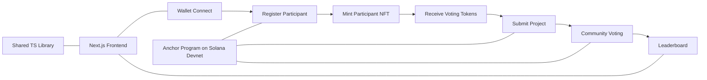

# HackProof Prototype

A **decentralized hackathon voting prototype** built on **Solana**.

HackProof lets participants register with a wallet, mint a participant NFT, submit projects, and vote with on-chain tokens to produce a transparent leaderboard.

> This is an older prototype, but it demonstrates the full core idea end-to-end: identity + project proof + tokenized peer voting.

## What this project does

- **Participant registration** on Solana
- **Participant NFT minting** (identity credential)
- **Project submission** tied to participant identity
- **Token-based voting** with anti-self-vote checks
- **Live ranking/leaderboard** based on votes
- **Shared metadata/IPFS utilities** for reusable storage logic

## Visual overview



## Why HackProof

Hackathons are often judged in ways that feel opaque. HackProof explores a model where:

- project and participant data is verifiable,
- votes are traceable on-chain,
- and final rankings are easier to trust.

## Repository layout

```text
HackProof-prototype/
├── hackproof/            # Solana Anchor program (smart contract)
├── hackproof-frontend/   # Next.js frontend app
├── shared/               # Shared TypeScript library (metadata/storage/types)
├── INTEGRATION_STATUS.md # Integration notes and status
└── ProjectOutline.md     # Original concept and roadmap
```

## Core stack

- **Blockchain:** Solana Devnet + Anchor
- **Frontend:** Next.js + React + TypeScript
- **Wallets:** Solana wallet adapter (Phantom and others)
- **Storage utilities:** Shared IPFS/metadata helpers in `shared/`

## Quick start

### 1) Frontend

```bash
cd hackproof-frontend
npm install
npm run dev
```

### 2) Solana program workspace

```bash
cd hackproof
npm install
npm run lint
```

### 3) Shared package

```bash
cd shared
npm install
npm test
```

## Current prototype notes

- Program ID and integration details are documented in `INTEGRATION_STATUS.md`.
- The hackathon must be initialized on-chain before participant registration can complete.
- This repository is focused on a working prototype flow and experimentation.

---

If you're exploring the idea: start in `hackproof-frontend/src/app/page.tsx`, then follow the registration and submission pages.
